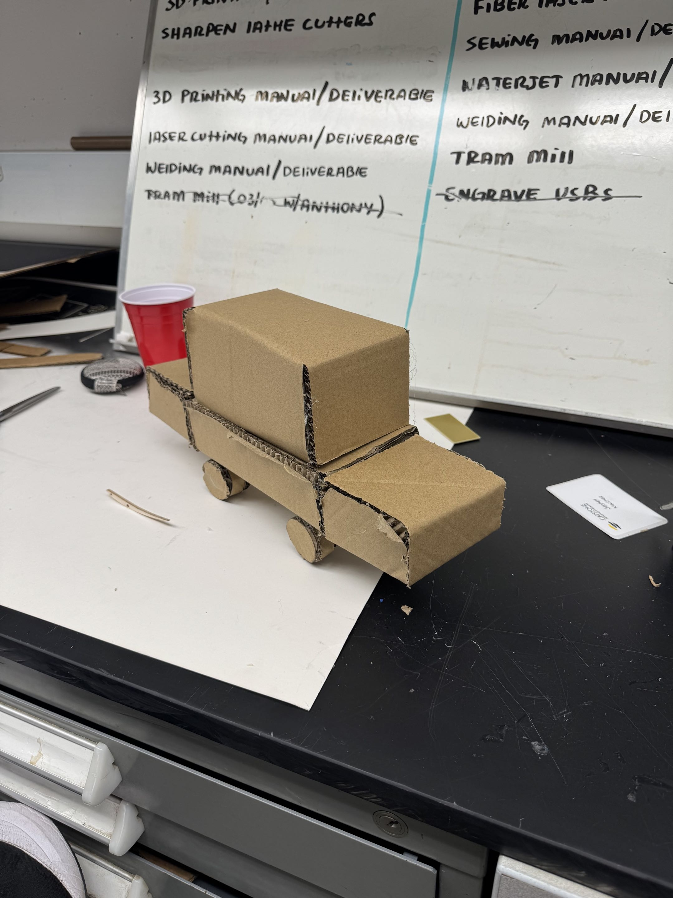
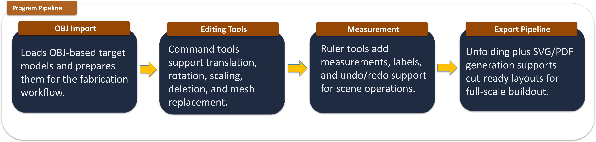
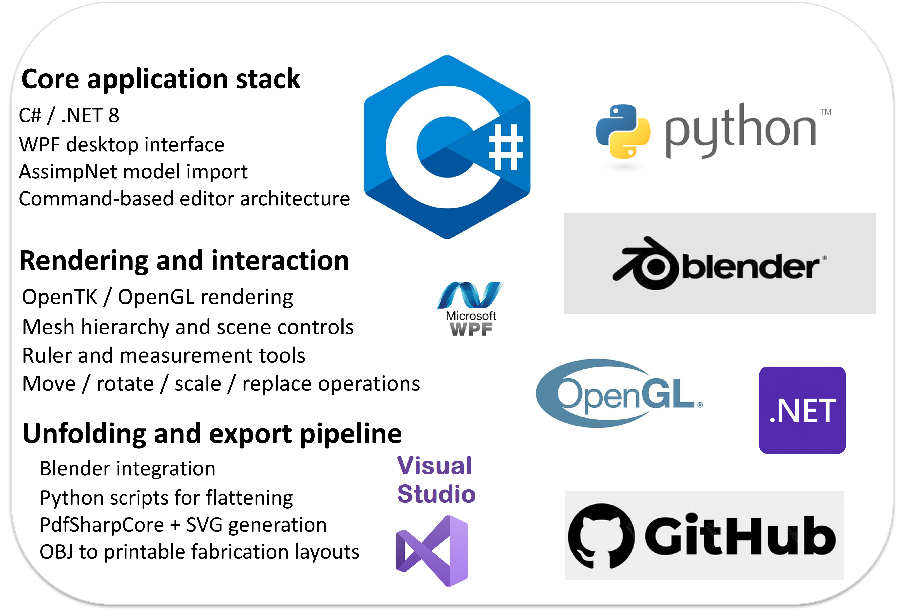
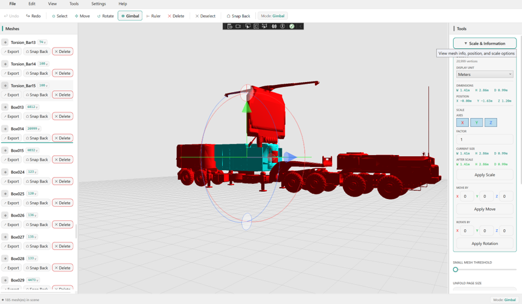
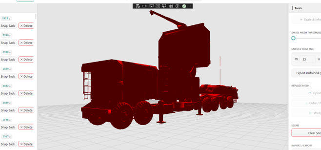

<div align="center">
  <table width="100%">
    <tr>
      <td align="center"></td>
      <td align="center"></td>
      <td align="center"></td>
    </tr>
  </table>
</div>

<br />

<div align="center">

# UnBox3D

**3D mesh unfolding and fabrication toolchain for .NET**

UnBox3D takes any 3D model and flattens it into precise, cut-ready 2D layouts complete with fold annotations, part IDs, and assembly instructions. Built for convenient use with laser cutters and CNC machines.

[](https://dotnet.microsoft.com/)
[](https://github.com/CrisM6285/UnBox3D)
[](LICENSE)

</div>

---

<details>
<summary><b>Table of Contents</b></summary>

- [Overview](#overview)
- [System Requirements](#system-requirements)
- [Key Features](#key-features)
- [Using UnBox3D](#using-unbox3d)
- [Getting Started](#getting-started)
- [Configuration](#configuration)
- [For Future Contributors](#for-future-contributors)
- [Contributors](#contributors)

</details>

---

## Overview



UnBox3D implements a full pipeline from 3D input to fabrication-ready output:

1. **Mesh ingestion** — import OBJ, STL, or PLY files
2. **Simplification** — reduce polygon count via quadric error metrics
3. **Seam selection & unfolding** — automatic or manual seam placement, unwrap to flat 2D islands
4. **Layout packing** — non-overlapping arrangement within your sheet or bed size
5. **Export** — SVG or PDF with dedicated cut, score, and label layers

The goal is a consistent, reproducible path from any 3D mesh to physical assembly — maximum automation for the most efficient workflow.

<br clear="right" />

### Pipeline

<div align="center">
  
</div>

---

## Blender Integration


Blender drives a significant portion of UnBox3D's core functionality. Mesh processing, seam detection, and the unfolding computation all run through Blender's Python API.

Central to this is the **Export Paper Model** addon, which handles the conversion of a 3D mesh into a printable 2D net. We are grateful to [**addam**](https://github.com/addam) for their work on this addon — without it, the unfolding pipeline would not be possible.

- 📦 [Addon on Blender Extensions](https://extensions.blender.org/add-ons/export-paper-model/)
- 💻 [Source on GitHub](https://github.com/addam/Export-Paper-Model-from-Blender)

> Blender 4.3 or higher is recommended. If not already installed, UnBox3D will install it automatically on first launch.

<br clear="right" />

---

## System Requirements

- **.NET 8 SDK** or newer
- **Windows 10/11 (x64)** recommended; Linux/macOS supported for CLI
- For GUI builds, Windows is required (WPF)

Verify your setup:

```bash
dotnet --info
```

---

## Key Features

| Feature | Description |
|---------|-------------|
| 🗂 Mesh Import | OBJ, STL, PLY with automatic triangulation |
| ✂️ Simplification | Quadric error metrics with tunable face-count and error budgets |
| 🧵 Seam Placement | Heuristic selection based on curvature, geodesic distance, and part size |
| 📐 2D Unwrap | Non-overlapping layout packing with configurable sheet margins |
| 📤 Export | DXF, SVG, and PDF with separate cut / score / label layers |
| 🖥 Desktop GUI | Interactive 3D viewport for preview and manual editing |
| ⌨️ CLI | Batch and headless operation for automation and CI |

### Tech Stack

From importing to unfolding, open source tools and libraries are utilized for tried-and-tested moves towards a reliable end result.

<div align="center">
  
</div>

---

## Using UnBox3D

### Viewport & Gizmos

The desktop GUI provides a full 3D viewport with transform gizmos for positioning, rotating, and scaling the mesh before unfolding.

<div align="center">
  
</div>

### Mesh Simplification

UnBox3D can reduce high-polygon meshes to a manageable face count before unfolding, preserving shape fidelity while making the output suitable for fabrication.

<div align="center">
  
</div>

### Typical Workflow

1. **Import** a mesh (OBJ / STL / PLY)
2. **Simplify** to a target face count or error threshold
3. **Mark seams** manually or let the heuristic handle it, then **unwrap**
4. **Pack** islands into your sheet/bed dimensions
5. **Export** DXF / SVG / PDF with cut and score layers

### Supported Formats

| Direction | Formats |
|-----------|---------|
| Input | OBJ, STL, PLY |
| Output | DXF (R12+), SVG, PDF |

---

## Getting Started

### Prerequisites

- [.NET 8 SDK](https://dotnet.microsoft.com/en-us/download)
- Optionally: JetBrains Rider or Visual Studio 2022
- Blender will be installed automatically on first launch. If already installed, it will be loaded automatically instead. Blender 4.3 or higher is recommended.

<details>
 <summary><b>Clone & Restore</b></summary>
 
 ```bash
 git clone https://github.com/CrisM6285/UnBox3D.git
 cd UnBox3D
 dotnet restore
 ```
</details>

<details>
<summary><b>Build</b></summary>

```bash
# Full solution
dotnet build -c Release

# Specific project
dotnet build src/UnBox3D/UnBox3D.csproj -c Release
```

</details>

<details>
<summary><b>Run (GUI)</b></summary>

```bash
dotnet run --project src/UnBox3D.UI/UnBox3D.UI.csproj -c Debug
```

Or open the solution in Rider / Visual Studio and press ▶️.

</details>

<details>
<summary><b>Run (CLI)</b></summary>

```bash
dotnet run --project src/UnBox3D/UnBox3D.csproj -- \
  --input assets/samples/bunny.obj \
  --target-faces 5000 \
  --sheet-width 600 --sheet-height 400 \
  --export svg --out ./out/bunny
```

**Common flags:**

```
--input <file|folder>       Mesh file or folder for batch mode
--target-faces <int>        Simplification target (face count)
--max-error <float>         Simplification target (quadric error)
--sheet-width <mm>          Sheet width
--sheet-height <mm>         Sheet height
--pack-padding <mm>         Margin between packed islands
--export <dxf|svg|pdf>      Output format
--out <path>                Output directory
--labels on|off             Include part/assembly labels
--headless                  CI/batch mode (no GUI)
--verbose                   Detailed logging
```

</details>

---

## Configuration

Settings can be supplied via CLI flags or `appsettings.json` placed next to the app:

```json
{
  "Unfold3D": {
    "Simplification": {
      "TargetFaceCount": 5000,
      "PreserveBoundaries": true
    },
    "Unwrap": {
      "SeamHeuristic": "Curvature",
      "PackPaddingMm": 2.0,
      "Sheet": { "WidthMm": 600, "HeightMm": 400 }
    },
    "Export": {
      "Format": "DXF",
      "IncludeLabels": true,
      "LayerNames": { "Cut": "CUT", "Score": "SCORE", "Text": "TEXT" }
    }
  }
}
```

Environment variables are also supported: `Unfold3D__Export__Format=SVG`

---

## For Future Contributors

<details>
<summary><b>Architecture Overview</b></summary>

```
UnBox3D.sln
├─ Assets/                  Application and UI icons
├─ Commands/                Command logic (export, simplify, replace)
├─ Controls/                Mouse, camera, and UI interaction
├─ Models/                  Core 3D data structures (mesh, simplification)
├─ Rendering/               OpenGL rendering, shaders, scene drawing
├─ Scripts/                 Build and automation scripts
├─ Utils/                   Logging, settings, memory management
├─ ViewModels/              Data bindings between models and views
├─ Views/                   WPF/XAML UI layouts
└─ UnBox3D.csproj
```

- **Core** encapsulates mesh ops and unfolding algorithms
- **IO** contains importers/exporters and format adapters
- **UI** provides the 3D/2D viewport and workflow controls
- **App** wires everything together with DI, config, logging, and CLI

</details>

<details>
<summary><b>Testing</b></summary>

Logs are saved to AppData automatically. Existing test cases are located in UnBox3D.Tests/Models, although automated testing remains quite limited.

</details>

<details>
<summary><b>Publish / Distribute</b></summary>

```bash
# Windows x64 (self-contained)
dotnet publish src/UnBox3D/UnBox3D.csproj -c Release -r win-x64 \
  --self-contained true -p:PublishSingleFile=true -o ./publish/win

# Linux / macOS
dotnet publish src/UnBox3D/UnBox3D.csproj -c Release -r linux-x64 -o ./publish/linux
dotnet publish src/UnBox3D/UnBox3D.csproj -c Release -r osx-arm64  -o ./publish/osx
```

</details>

<details>
<summary><b>Troubleshooting</b></summary>

**`MSB1009: Project file does not exist`** — run `dir /s *.csproj` (Windows) or `find . -name "*.csproj"` to locate the correct path.

**Overlapping islands** — increase `--pack-padding` and/or reduce `--target-faces` before unwrapping.

**Wrong scale in output** — ensure mesh units are in mm. Some OBJ/STL files are unitless; use a known reference part or add an explicit scale flag.

**GUI won't run on Linux/macOS** — WPF is Windows-only. Use the CLI, or consider an Avalonia port for cross-platform GUI.

</details>

<details>
<summary><b>Contributing</b></summary>

1. Fork and create a feature branch
2. Add tests for new functionality
3. Run `dotnet format` and ensure linters pass
4. Open a PR with a clear description and screenshots for UI changes

</details>

---

## Contributors

<a href="https://github.com/CrisM6285/UnBox3D/graphs/contributors?from=2%2F14%2F2026">
  
</a>

---

<div align="center">
  <sub>Built at <a href="https://www.calstatela.edu/">Cal State LA</a> in partnership with the <a href="https://www.arl.army.mil/">Army Research Laboratory</a></sub>
</div>
